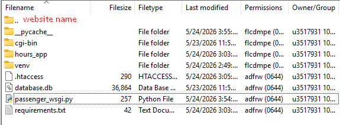
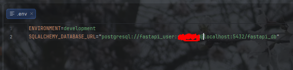

kaiser-workingground.ru

Рабочий проект FastAPI, готовый к deploy'ю на reg.ru. Немного подробнее написал про сам деплой тут https://ru.stackoverflow.com/a/1625572/776077 .

venv создавать в корневой папке, т.е. на том же уровне где находится requirements.txt
вот корректная иерархия файлов:

cgibin, .htaaccess - автоматический мусор от reg.ru.
;

hours_app -> SPA с использованием HTMX. Включает в себя создание-изменение-удаление аккаунта, создание-изменение-удаления постов(sesh), листинг этих
постов, поиск этих постов. Аутентификация сделана с нуля с помощью JWT токенов и их сохранении в cookie сайта, работает и на localhost
и в продакшене. Для тестинга и Swagger UI также работает аутентификация с помощью Header'ов. 

Чтобы использовать проект через Swagger UI, достаточно зайти на / ссылку, либо самостоятельно ввести /docs. Чтобы использовать HTMX SPA,
необходимо перейти на /interactions, e.g. kaiser-workingground.ru/interactions. 

hours_app_ru - версия с русским текстом БЕЗ htmx. Для корректной работы необходимо переименовать "hours_app_ru" в "hours_app". Очень сильно отстает от актуальной версии сайта. 

p.s. .env file having "SQALCHEMY_DATABASE_URL" is required for script to function with a postgresql database. It is not required for versions before "psql integration".

Example of a proper .env file: , you'd also need to change ENVIRONMENT to "production" for correct functionality in production.

PSQL/SQLAlchemy - по дефолту используется SQLAlchemy/sqlite датабаза, которая работает без установки и сетапа postgresql. Для использования postgresql, 
помимо его установки, надо закомментировать строчку содержащую "# for docker/sqlite" в config.py и откомментировать следующую строчку после нее. Также в файле .env 
надо использовать `SQLALCHEMY_DATABASE_URL="sqlite:///database.db"`.  